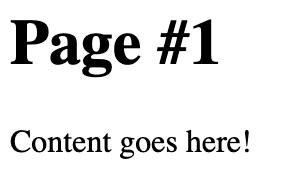

# 4_Flask_Server
A simple web server created using flask. This webserver was used to make a simple blog application

## Screenshots

### Homepage

### Detail page 1

## Objectives

### Learning Objectives

After completing this project I know:
 * How to create and configure web servers in flask
 * How to create routes using decorators
 * How to use query strings to carry input from previous pages
 * How to use flask's template language in HTML to avoid repetition
 * How to interpret CSVs and use them for site data
 
 ## Technologies Used
 * Python
 * Flask
 * PyCharm
 * Flask Template Language
 * Query Strings